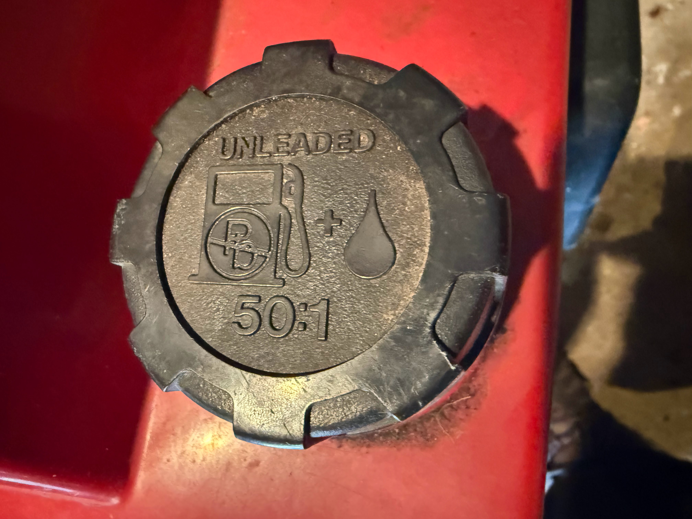
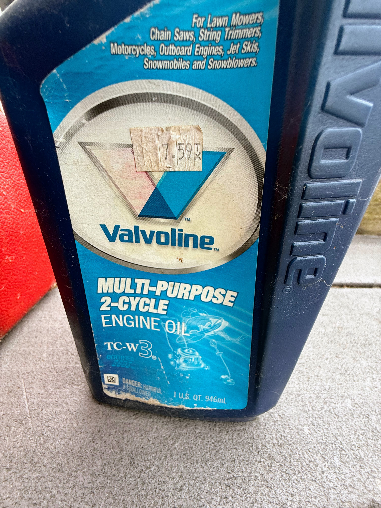

# How to Gas Up the Snowblower

This guide help you understand how to fill a two cycle snowblower with the
correct gas and oil mixture.

## Background

Our snowblower is a two-cycle type that MUST have the proper mixture of oil and gas.
This guide shows you how to do this.

## Gas Container

Here is the gas container.  Go to the gas station and fill it up.
This one holds 1 1/4 gallons of gas.  For this guide, we will
assume a full container, but you can also use partially filled
containers as long as you can estimate the amount of gas in the container.

## Gas and Oil Mix Calculator

Use this MicroSim to calculate how much two-cycle oil to add for a given
amount of gas and a target ratio.

<iframe src="sims/gas-oil-mix/main.html" height="482px" width="100%" scrolling="no"></iframe>

## Gas Cap on the Snowblower

This is an image of the gas cap on the snowblower.  You will note
that it indicates that the proper mixture is 50 to 1.

## Two Cycle Oil

This is a photo of the two cycle oil bottle.  Some have a transparent part on the side to show you how much is in the bottle.  Ours does not have this.

## How to Measure the Oil
